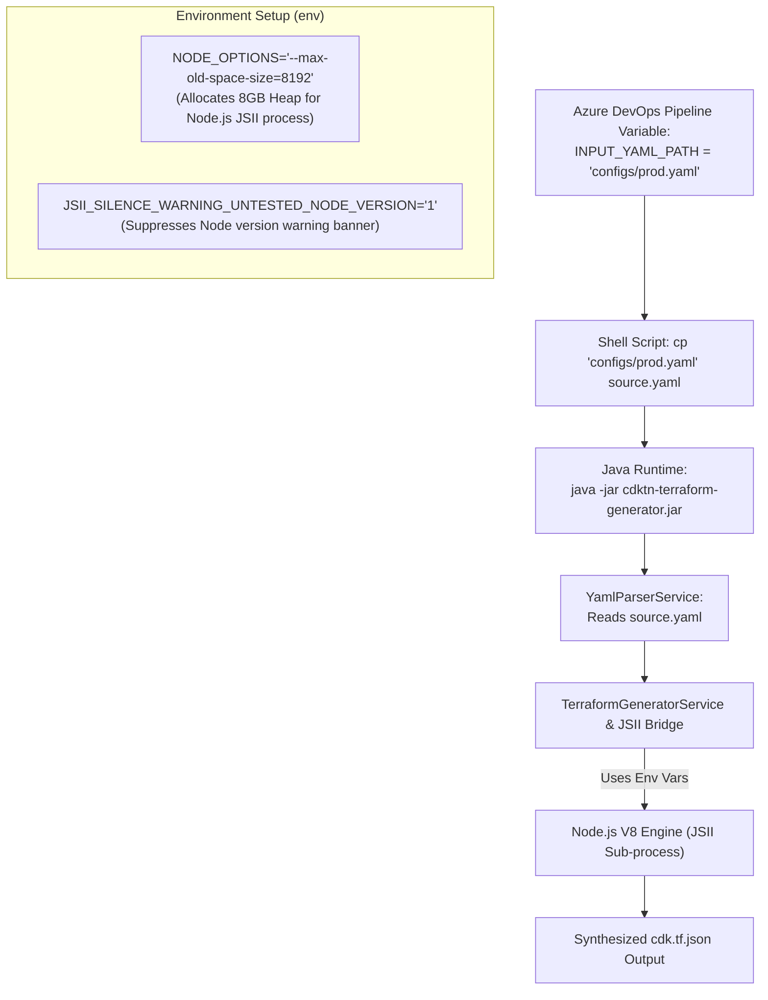

# CDKTN Terraform Generator

Spring Boot 3.3.3 / Java 17+ batch CLI service to deserialize YAML configurations into valid Terraform JSON (`cdk.tf.json`) using the **CDK-Terrain (cdktn 0.23.0)** Open Constructs SDK.

---

## Key Features

- **Mandatory Storage Account Validation:** Enforces mandatory `id` validation for every storage account construct. Missing or blank IDs trigger a fast-failing `ConfigurationLoadException` (subtype of `RuntimeException`).
- **High-Throughput Streaming Parser:** Jackson streaming parser capable of processing 10,000+ line YAML files with low memory footprint.
- **Parallel Multi-Partition Synthesis:** Distributes large construct datasets across thread pools for parallel stack synthesis.
- **AST Merging & Upserting:** Deep-merges synthesized YAML resources into existing `cdk.tf.json` files without overwriting unrelated providers or backend definitions.
- **Sanitized Output:** Automatically omits empty maps (`{}`) and empty arrays (`[]`) from synthesized JSON to ensure valid Terraform resource paving.
- **Azure DevOps Pipeline Native:** Configured with `spring.main.web-application-type=none` to run as an ephemeral CLI application in CI/CD pipelines.

---

## Terminal Initiation & CLI Usage

### Build Executable Fat JAR
```bash
mvn clean package -DskipTests
```

### CLI Command Syntax
```bash
java -jar target/cdktn-terraform-generator-1.0.0-SNAPSHOT.jar <input-yaml-path> <stack-name> <output-dir>
```

---

## CLI Positional Arguments Breakdown

| Argument Pos | Parameter Name | Data Type | Description | Example Value |
| :--- | :--- | :--- | :--- | :--- |
| `args[0]` | **`<input-yaml-path>`** | `String` (File Path) | **Location of the input YAML file** containing Storage Account constructs, budgets, containers, tags, and environments. | `source.yaml` |
| `args[1]` | **`<stack-name>`** | `String` (Identifier) | **Logical name of the CDKTF Terraform Stack**. Determines the directory structure created inside the output path (`stacks/<stack-name>/cdk.tf.json`). | `DataLakeProdStack` |
| `args[2]` | **`<output-dir>`** | `String` (Directory Path) | **Target directory path** where CDKTF synthesizes the Terraform JSON output file. | `./cdktf_out` |

---

## End-to-End Example

### 1. Input File (`source.yaml`)
```yaml
storage_accounts:
  adax_doc_grok:
    id: "dgrok"
    tribe: "docgrok"
    performance: "Standard"
    redundancy: "LRS"
    accessTier: "Hot"
    tags:
      blk-business-unit: "AI-Platform"
    containers:
      adax-doc-grok-data:
        access_tier: "Hot"
```

### 2. Terminal Execution Command
```bash
java -jar target/cdktn-terraform-generator-1.0.0-SNAPSHOT.jar \
  source.yaml \
  DataLakeProdStack \
  ./cdktf_out
```

### 3. Generated Directory Structure
```
cdktf_out/
└── stacks/
    └── DataLakeProdStack/
        └── cdk.tf.json
```

### 4. Generated `cdk.tf.json` AST Output
```json
{
  "resource": {
    "azurerm_storage_account": {
      "sa_adax_doc_grok": {
        "access_tier": "Hot",
        "account_id": "dgrok",
        "account_replication_type": "LRS",
        "account_tier": "Standard",
        "name": "adax_doc_grok",
        "tags": {
          "blk-business-unit": "AI-Platform"
        },
        "tribe": "docgrok"
      }
    },
    "azurerm_storage_container": {
      "container_adax_doc_grok_adax-doc-grok-data": {
        "access_tier": "Hot",
        "name": "adax-doc-grok-data",
        "storage_account_name": "adax_doc_grok"
      }
    }
  }
}
```

---

## Azure DevOps Pipeline Integration (`azure-pipelines.yml`)

```yaml
trigger:
  - main

pool:
  vmImage: 'ubuntu-latest'

steps:
- task: JavaToolInstaller@0
  inputs:
    versionSpec: '17'
    jdkArchitectureOption: 'x64'
    jdkSourceOption: 'PreInstalled'

- script: |
    mvn clean package -DskipTests
  displayName: 'Build CDKTN Generator JAR'

- script: |
    echo "=== Running CDKTN Terraform Generator ==="
    # Copy target pipeline YAML input to source.yaml if provided dynamically
    if [ -f "$(INPUT_YAML_PATH)" ]; then
      cp "$(INPUT_YAML_PATH)" source.yaml
    fi

    java -jar target/cdktn-terraform-generator-1.0.0-SNAPSHOT.jar
  displayName: 'Execute CDKTN Generator'
  env:
    NODE_OPTIONS: '--max-old-space-size=8192'
    JSII_SILENCE_WARNING_UNTESTED_NODE_VERSION: '1'

- task: PublishPipelineArtifact@1
  inputs:
    targetPath: '$(System.DefaultWorkingDirectory)/output'
    artifact: 'terraform-json-artifact'
    publishLocation: 'pipeline'
  displayName: 'Publish Generated Terraform JSON'
```

---

## Azure DevOps Execution Architecture & Environment Variables



### Detailed Breakdown

1. **Dynamic Input Mapping (`cp "$(INPUT_YAML_PATH)" source.yaml`):**
   - Maps dynamic pipeline input paths (e.g., `$(INPUT_YAML_PATH)`) to `source.yaml` in the working directory before executing the default Java application entry point.

2. **`NODE_OPTIONS: '--max-old-space-size=8192'`:**
   - CDK-Terrain (`cdktn`) bridges Java calls to an underlying Node.js V8 process via JSII.
   - Setting `--max-old-space-size=8192` expands the Node.js V8 heap limit from default 2GB to **8GB**, ensuring large multi-partition constructs (10,000+ lines of YAML) synthesize without out-of-memory errors.

3. **`JSII_SILENCE_WARNING_UNTESTED_NODE_VERSION: '1'`:**
   - Silences version warning banners produced when the pipeline runner uses a newer or non-LTS Node.js runtime, keeping CI/CD logs clean.

---

## Running Unit Tests

Execute test suite (11 unit tests covering validation, parsing, upserting, and parallel synthesis):
```bash
mvn clean test
```

