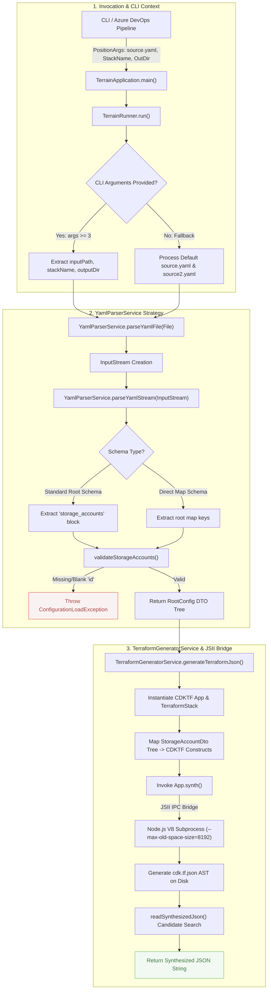
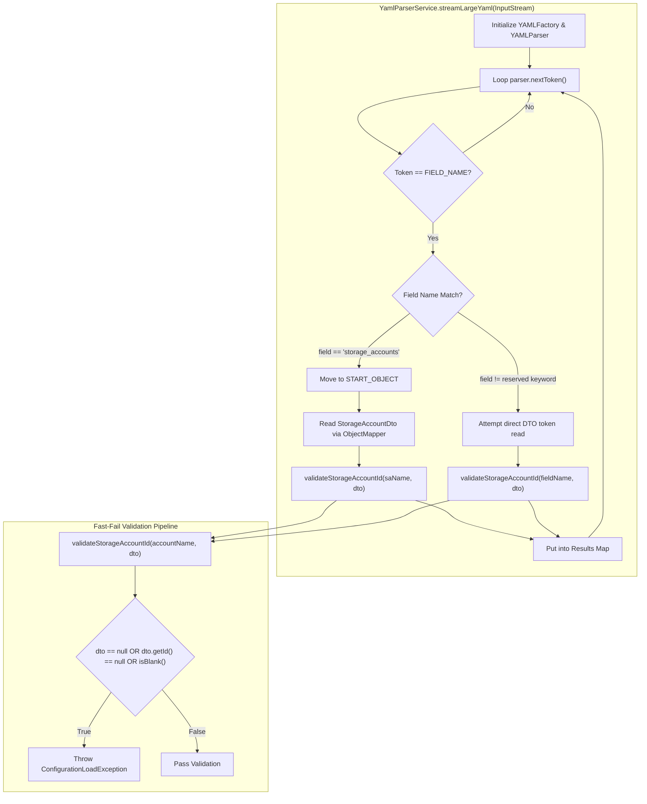
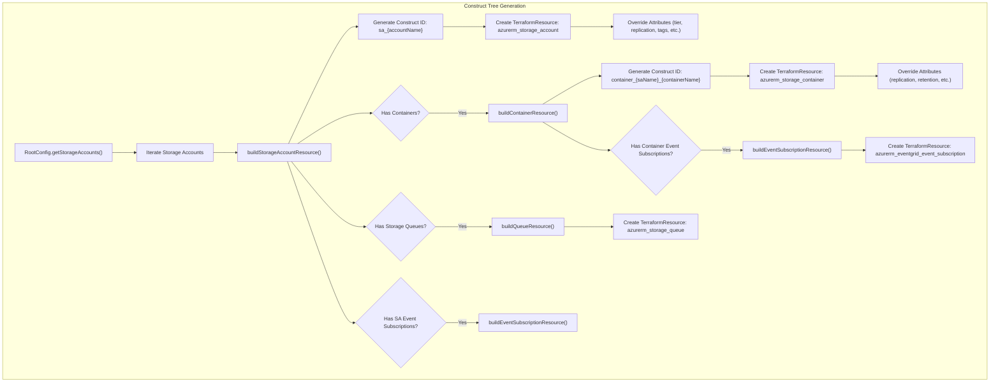
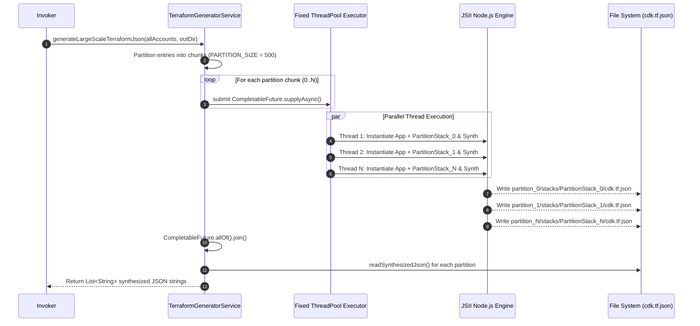
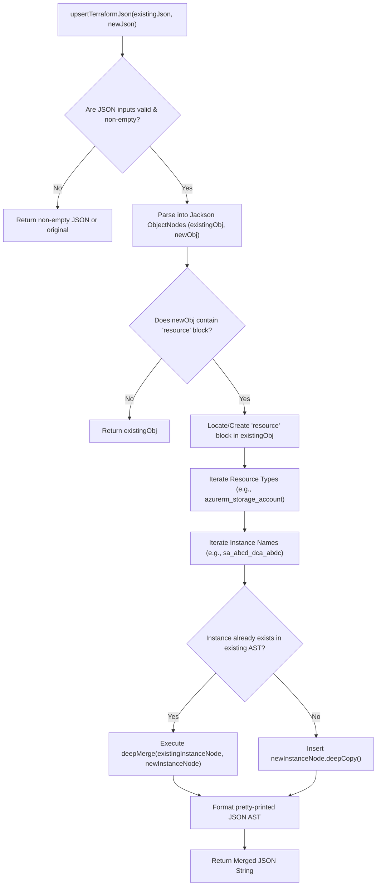

# CDKTN Terraform Generator - System Architecture & Execution Flow Diagrams

This document details the architectural design, component interactions, execution lifecycle, parsing strategy, parallel partition synthesis, and AST merging mechanisms for the **CDKTN Terraform Generator** application.

---

## System Overview

The CDKTN Terraform Generator is a Spring Boot batch CLI application designed to parse dynamic infrastructure configurations written in YAML and synthesize valid Terraform JSON (`cdk.tf.json`) via the HashiCorp CDK-Terrain (CDKTF) Java SDK.

---

## 1. High-Level End-to-End System Architecture & Lifecycle Flow

This diagram illustrates the entry point orchestration in [`TerrainApplication.java`](file:///Users/kvperumal/office/CDKTN/src/main/java/com/blackrock/terrain/TerrainApplication.java), showing how CLI arguments or default fallback pipeline files trigger parsing, construct tree building, JSII V8 bridge execution, and synthesized artifact generation.

---

## 2. High-Throughput Streaming & Standard YAML Parsing Flow

Detailed execution path within [`YamlParserService.java`](file:///Users/kvperumal/office/CDKTN/src/main/java/com/blackrock/terrain/service/YamlParserService.java), covering standard object mapping vs high-throughput tokenized streaming parsing (`streamLargeYaml`) for large datasets (10,000+ lines of YAML).

---

## 3. CDKTF Resource Construct Tree Synthesis Flow

Traces how nested DTOs ([`StorageAccountDto`](file:///Users/kvperumal/office/CDKTN/src/main/java/com/blackrock/terrain/dto/StorageAccountDto.java), [`ContainerDto`](file:///Users/kvperumal/office/CDKTN/src/main/java/com/blackrock/terrain/dto/ContainerDto.java), [`QueueDto`](file:///Users/kvperumal/office/CDKTN/src/main/java/com/blackrock/terrain/dto/QueueDto.java), [`EventSubscriptionDto`](file:///Users/kvperumal/office/CDKTN/src/main/java/com/blackrock/terrain/dto/EventSubscriptionDto.java)) are mapped into CDKTF Open Constructs inside [`TerraformGeneratorService.java`](file:///Users/kvperumal/office/CDKTN/src/main/java/com/blackrock/terrain/service/TerraformGeneratorService.java).

---

## 4. Parallel Multi-Partition Synthesis Pipeline

For processing multi-partition configurations, `generateLargeScaleTerraformJson(...)` partitions inputs into batches of 500 constructs (`PARTITION_SIZE`) and executes parallel stack synthesis via an `ExecutorService` thread pool.

---

## 5. AST Deep-Merging & Upsert Strategy (`upsertTerraformJson`)

When updating existing Terraform configurations without destroying unmanaged resource blocks or provider configurations, `upsertTerraformJson` performs a deep merge on the JSON Abstract Syntax Tree (AST).

---

## Key Architectural & Implementation Highlights

1. **Fast-Fail Guardrails:**  
   - Mandatory attribute `id` validation is executed during deserialization in [`YamlParserService.java`](file:///Users/kvperumal/office/CDKTN/src/main/java/com/blackrock/terrain/service/YamlParserService.java#L179-L185). Missing or blank IDs trigger a fast-failing [`ConfigurationLoadException`](file:///Users/kvperumal/office/CDKTN/src/main/java/com/blackrock/terrain/exception/ConfigurationLoadException.java).
2. **JSII Interop & Heap Allocation:**  
   - CDKTF interop bridges Java to a Node.js V8 sub-process. For processing large multi-partition constructs, set `NODE_OPTIONS='--max-old-space-size=8192'` in CI/CD pipeline step environments.
3. **AST Structure Preservation:**  
   - `upsertTerraformJson` deep-merges newly synthesized constructs while preserving non-colliding `resource`, `provider`, and `backend` blocks in target JSON AST files.
